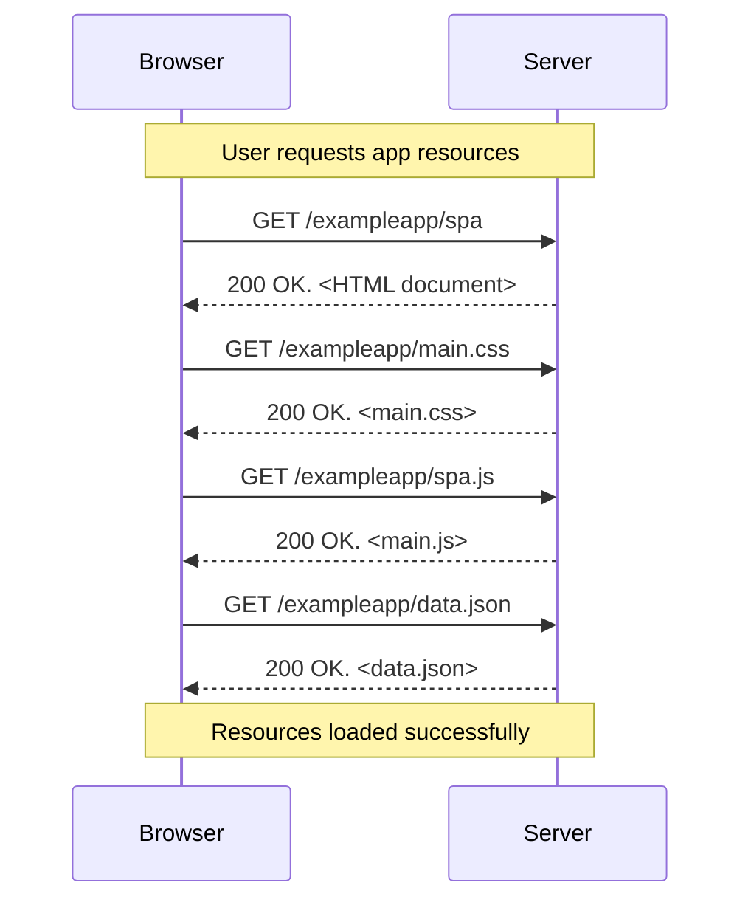

Loading SPA Notes Page

```mermaid
sequenceDiagram
    participant Browser
    participant Server
    note over Browser, Server: User requests app resources

    Browser->>Server: GET /exampleapp/spa
    Server-->>Browser: 200 OK. <HTML document>

    Browser->>Server: GET /exampleapp/main.css
    Server-->>Browser: 200 OK. <main.css>

    Browser->>Server: GET /exampleapp/spa.js
    Server-->>Browser: 200 OK. <main.js>

    Browser->>Server: GET /exampleapp/data.json
    Server-->>Browser: 200 OK. <data.json>

    note over Browser, Server: Resources loaded successfully


```