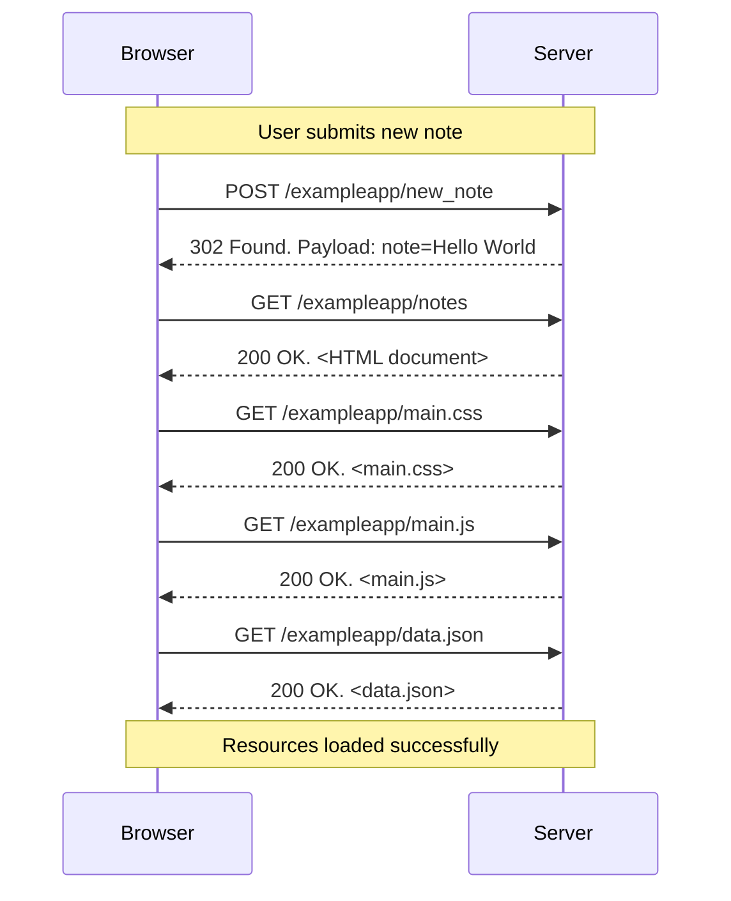

New Note Diagram, Old School

```mermaid
sequenceDiagram
    participant Browser
    participant Server
    note over Browser, Server: User submits new note

    Browser->>Server: POST /exampleapp/new_note
    Server-->>Browser: 302 Found. Payload: note=Hello World

    Browser->>Server: GET /exampleapp/notes
    Server-->>Browser: 200 OK. <HTML document>

    Browser->>Server: GET /exampleapp/main.css
    Server-->>Browser: 200 OK. <main.css>

    Browser->>Server: GET /exampleapp/main.js
    Server-->>Browser: 200 OK. <main.js>

    Browser->>Server: GET /exampleapp/data.json
    Server-->>Browser: 200 OK. <data.json>

    note over Browser, Server: Resources loaded successfully


```